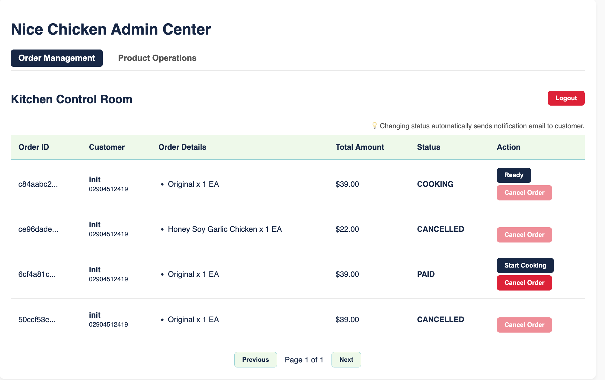
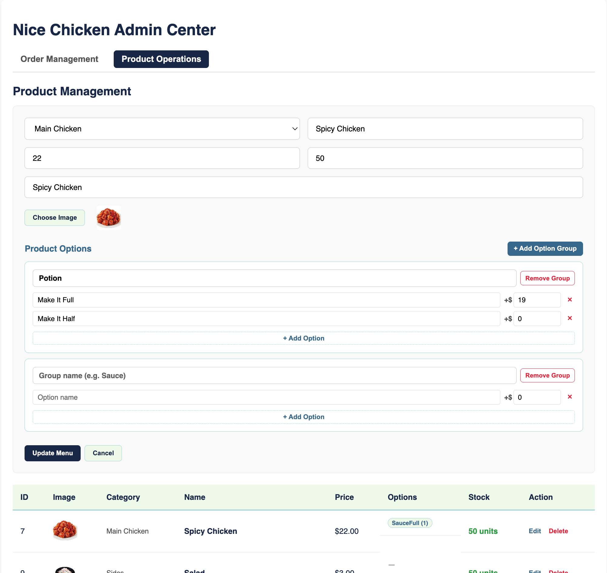
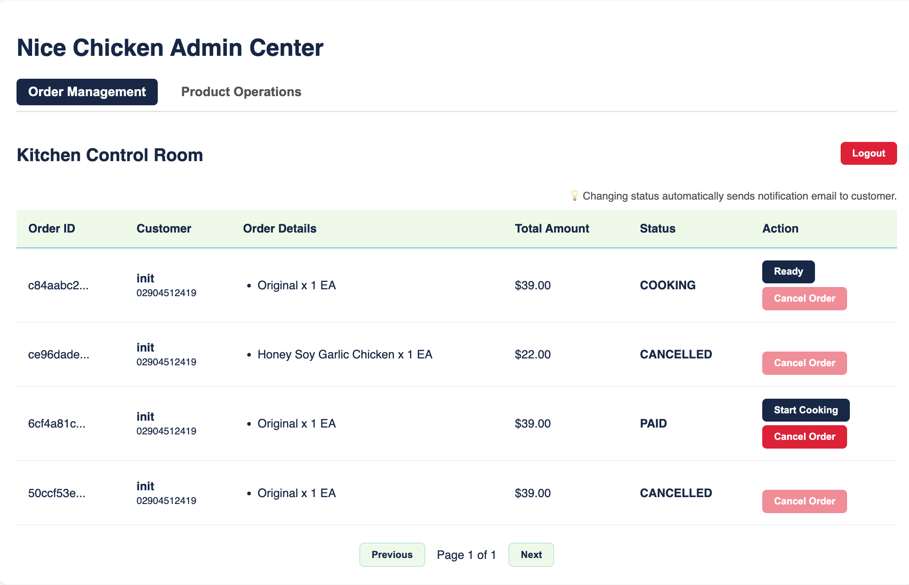

# 🍗 Nice Chicken

A full-stack chicken restaurant ordering system built for takeaway and dine-in, featuring real-time order tracking, Stripe payments, and a dedicated admin dashboard.

**Live Demo:** [nice-chicken.junhub.dev](https://nice-chicken.junhub.dev)

---

## 🚀 How to Try the Demo

1. **Sign In**: Click the login button to authenticate quickly via Google OAuth2.

3. **Place an Order**: Browse the menu, select your desired options (e.g., half/full, etc), and add them to your cart.

4. **Checkout (Test Payment)**: Proceed to checkout.
   > ⚠️ **Important:** This is a test environment. **Please use a [Stripe Mock Card](https://stripe.com/docs/testing) to complete the payment.**
   > * Simply enter `4242 4242 4242 4242` for the card number.
   > * Use any future expiration date (e.g., `12/30`) and any 3-digit CVC (e.g., `123`).
   > * **Do NOT use real credit card information.**
   
5. **Real-time Tracking**: Once paid, watch your order status update in real-time (from PENDING to PAID → COOKING → READY → PICKED_UP) via Server-Sent Events!

> 🔒 **Note for Admin & SSE Testing:**
> The Admin Dashboard and the ability to manually trigger SSE order state changes (e.g., moving an order from COOKING to READY) are restricted. To fully test these features, please clone the repository and set it up locally with your own environment variables, or contact the developer directly for temporary admin access.

6. **Admin Sample**





---

## Tech Stack

### Backend
| Layer | Technology |
|---|---|
| Language | Java 21 |
| Framework | Spring Boot 4.0.4 |
| Database | PostgreSQL 15 |
| ORM | Spring Data JPA (Hibernate 7) |
| Auth | JWT (HttpOnly Cookie) + Google OAuth2 |
| Payments | Stripe Checkout + Webhooks |
| Real-time | Server-Sent Events (SSE) |
| Build | Gradle |
| Deploy | Docker + Docker Compose |

### Frontend
| Layer | Technology |
|---|---|
| Language | TypeScript 5.9 |
| Framework | React 19 |
| Build | Vite 7 |
| State | TanStack Query v5 |
| HTTP | Axios |
| Styling | CSS Modules |
| Deploy | Cloudflare Workers |

---

## Architecture

```
┌─────────────────────┐         ┌────────────────────────┐
│   React Frontend    │   SSE   │   Spring Boot API      │
│ nice-chicken.junhub │◄────────│ api-chicken.junhub.dev │
│       .dev          │────────►│                        │
│                     │  REST   │  ┌──────────────────┐  │
│  - Order Page       │         │  │  Security Layer  │  │
│  - Payment Flow     │         │  │  JWT + OAuth2    │  │
│  - Order History    │         │  │  CSRF Origin     │  │
│  - Admin Dashboard  │         │  └────────┬─────────┘  │
└─────────────────────┘         │  ┌────────▼─────────┐  │
                                │  │  Business Logic  │  │
                                │  │  Orders/Products │  │
┌─────────────────────┐         │  │  Payments/SSE    │  │
│      Stripe         │Webhook  │  └────────┬─────────┘  │
│  Payment Gateway    │────────►│  ┌────────▼─────────┐  │
└─────────────────────┘         │  │   PostgreSQL 15  │  │
                                │  └──────────────────┘  │
                                └────────────────────────┘
```

---

## Key Features

### Customer
- **Google OAuth2 Login** — One-click sign-in, JWT stored in HttpOnly cookie
- **Menu with Category Navigation** — Sticky tab bar with scroll-to-section, IntersectionObserver-based active tab tracking
- **Product Options** — Modal-based option selection (e.g., sauce type, spice level) with real-time price calculation
- **Cart** — Composite cart key system allowing same product with different options as separate entries, persisted to localStorage
- **Stripe Checkout** — Secure server-side session creation, 30-minute expiry
- **Real-time Order Tracking** — SSE push notifications for status changes (PENDING → PAID → COOKING → READY → PICKED_UP)
- **Order History** — View past orders with status, hide completed orders via soft delete

### Admin
- **Order Management Dashboard** — Real-time new order alerts via SSE, status progression controls
- **Product & Category CRUD** — Image upload, stock management, category sorting
- **Order Status History** — Full audit trail of who changed what and when

---

## Engineering Highlights

Things I intentionally designed and can speak to in an interview:

### Security
- **HttpOnly Cookie + CSRF Origin Filter** — JWT stored in HttpOnly cookie (immune to XSS), with a custom `CsrfOriginFilter` that validates `Origin`/`Referer` headers on state-changing requests. This defends against both XSS token theft and CSRF attacks simultaneously, without falling back to localStorage.
- **Cross-Origin SSE Authentication** — EventSource API can't send cookies cross-origin. Solved with a token exchange pattern: Axios fetches a short-lived (30s, single-use) SSE token via cookie auth, then EventSource connects with the token as a query param.
- **Stripe Webhook Signature Verification** — All webhooks verified via `Webhook.constructEvent()` before processing.

### Data Integrity
- **Order State Machine** — `OrderStatus` enum defines allowed transitions (e.g., CANCELLED is terminal). Prevents zombie orders from race conditions where a payment webhook arrives after cancellation.
- **Webhook Idempotency** — Duplicate Stripe webhooks are detected via `existsByStripePaymentIntentId` check before processing. Stripe guarantees at-least-once delivery, so this is mandatory.
- **Deadlock Prevention** — Cart items are sorted by `productId` before acquiring pessimistic locks (`PESSIMISTIC_WRITE`), ensuring consistent lock ordering across concurrent transactions.
- **Server-Side Price Validation** — Order total is independently calculated server-side and compared to client-submitted amount. Any discrepancy (even 1 cent) rejects the order.

### Performance
- **N+1 Query Prevention** — `hibernate.default_batch_fetch_size=100` for paginated admin queries. Product options batch-fetched via `findByProductIdIn` instead of per-product queries.
- **SSE over Polling** — Replaced 5-second polling with Server-Sent Events for real-time order status updates. Reconnect with exponential backoff (3s → 15s cap), automatic state sync on reconnect via query invalidation.

### Transaction Design
- **Stripe Refund Isolation** — `@TransactionalEventListener(AFTER_COMMIT)` + `@Async` + `@Transactional(REQUIRES_NEW)` ensures Stripe HTTP calls don't hold DB connections and only execute after successful cancel commit.
- **Rollback-Only Awareness** — Stock restoration on cancellation intentionally shares the parent transaction (no try-catch suppression) to maintain atomicity. If stock restoration fails, the entire cancellation rolls back — preventing inventory count drift.

### Event-Driven Architecture
```
Order Created  ─► Stock Deduction (sync, same tx)
Order Cancelled ─► Stock Restoration (sync, same tx)
                ─► Stripe Refund (async, after commit, new tx)
                ─► SSE Notification (async)
Payment Success ─► Order Status → PAID (sync)
                ─► Admin SSE Alert (sync)
Refund Complete ─► Admin SSE Alert (sync)
```

---

## Project Structure

```
nice-chicken/
├── nicechicken/                    # Backend (Spring Boot)
│   └── src/main/java/.../
│       ├── order/                  # Orders, status history, events
│       ├── product/                # Products, categories, options
│       ├── payment/                # Stripe checkout, webhooks, refunds
│       ├── notification/           # SSE emitters (admin + customer)
│       ├── user/                   # Auth, JWT, OAuth2, security filters
│       └── common/                 # Base entities, shared config
│
├── nicechickenfe/                  # Frontend (React + TypeScript)
│   └── src/
│       ├── features/
│       │   ├── orders/             # Order page, cart, menu, options modal
│       │   ├── payments/           # Stripe checkout flow
│       │   ├── admin/              # Admin dashboard, product management
│       │   └── auth/               # Login, OAuth callback
│       └── shared/                 # Types, API client, common components
│
└── README.md
```

---

## Getting Started

### Prerequisites
- Java 21
- Node.js 20+
- PostgreSQL 15
- Stripe account (test mode)
- Google OAuth2 credentials

### Backend
```bash
cd nicechicken

# Configure database and API keys in application.properties

./gradlew bootRun
# Runs on http://localhost:8080
```

### Frontend
```bash
cd nicechickenfe
npm install
npm run dev
# Runs on http://localhost:5173
```

### Production (Docker)
```bash
cd nicechicken
docker-compose up -d
# Backend: api-chicken.junhub.dev
# Frontend: Deployed separately via Cloudflare Workers
```

---

## Environment Variables (Production)

| Variable | Description |
|---|---|
| `DB_USERNAME` | PostgreSQL username |
| `DB_PASSWORD` | PostgreSQL password |
| `GOOGLE_CLIENT_ID` | Google OAuth2 client ID |
| `GOOGLE_CLIENT_SECRET` | Google OAuth2 client secret |
| `SMTP_USER` | Email sender address |
| `SMTP_PASS` | Email app password |

Stripe keys and JWT secret are configured in `application-prod.properties`.

---

## Order Flow

```
Customer                    Server                      Stripe
   │                          │                           │
   ├─ POST /orders ──────────►│ Validate + deduct stock   │
   │                          │ (pessimistic lock,        │
   │                          │  sorted by productId)     │
   │◄─ orderId ──────────────-┤                           │
   │                          │                           │
   ├─ POST /payments ────────►│ Create checkout session ─►│
   │◄─ Stripe URL ───────────-┤                           │
   │                          │                           │
   │──── Redirect to Stripe ─────────────────────────────►│
   │◄─── Redirect back ──────-────────────────────────────┤
   │                          │                           │
   │                          │◄── Webhook (signed) ──────┤
   │                          │ Idempotency check         │
   │                          │State machine: PENDING→PAID│
   │◄─ SSE: order_status ────-┤                           │
   │                          │                           │
```

---

## License

This project was built as a portfolio piece to demonstrate full-stack development skills with a focus on backend architecture, payment integration, and real-time systems.

